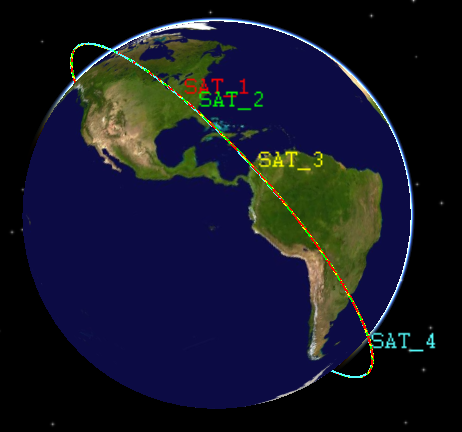

# page

this is markdown contents

## 二级标题

### 三级标题

[text_Sam](../text_Sam)

[text_Sam2](../text_Sam)

im1

im2

im3

## 二级标题

### 三级标题

#### 四级标题

这是一个**段落**| 作者 | 朝代 | 评分 |

| :--: | :--: | :--: |
| 李白 |  唐  | 100  |